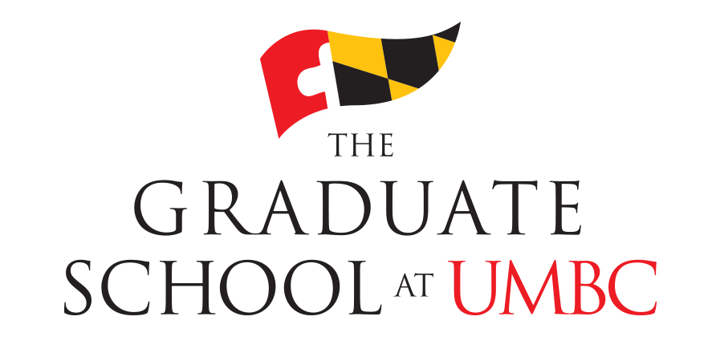

 

# MusicBrainz Database Project
Data-603 Project

This project aims to help users explore new songs by leveraging the user's currently played Spotify track to find synonyms of the first word in the song. Then the project looks up the word and synonyms in MusicBrainz's database.  With what song names are returned a graph representation is created for interactive exploring!

In the example below the user is listening to "Get on the Good Foot" by James Brown.  So "Get" is our keyword because it is the first word in the song title.  Then synonyms of "Get" are gathered.  After that, **"Green"** and all the synonyms gathered are found in song titles in the MusicBrainz database.  The search lookup is only for the sequence of letters. For example, the synonym "Please Love Me" by B.B King, is returned because "lease" is a synonym of "get", and "please" has the word "lease" within.  This website has compiled what other words could be found in song titles by searching "lease" in this way. 

https://www.thefreedictionary.com/words-containing-lease

Music Brainz database documentation
<li> https://musicbrainz.org/doc/MusicBrainz_Database/Schema</li>
 

Data is found:
db.utils("/FileStore/tables/adam_goldstein/MusicBrainz_historylistens.json)

db.utils("/FileStore/tables/adam_goldstein/MusicDataBase_SpotifyFeatures.csv)

Thank you to the githubs below:
<li>https://github.com/metabrainz/musicbrainz-docker</li>

<li>https://github.com/TheComeUpCode/SpotifyGeneratePlaylist</li>

